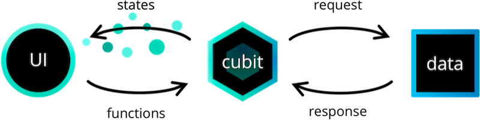
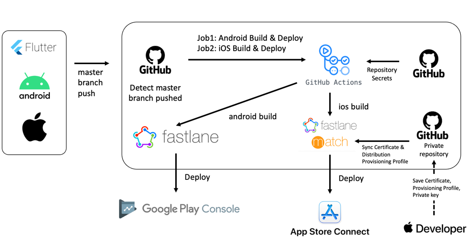
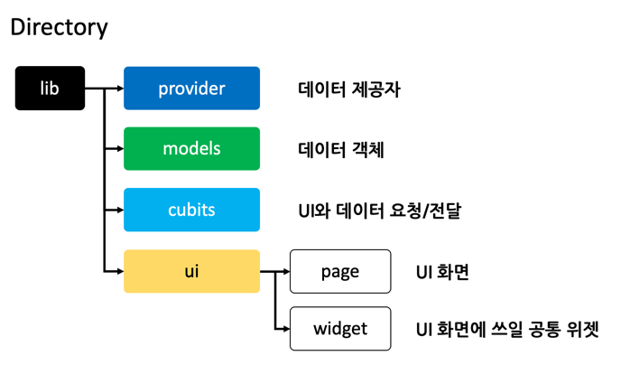

# 링크풀(LINKPOOL) - 체계적인 링크 관리의 시작

## 설치 링크

- PlayStore: https://play.google.com/store/apps/details?id=com.mr.ac_project_app
- AppStore: https://apps.apple.com/us/app/링크풀-체계적인-링크-관리의-시작/id1644108674

## 상태 관리

- [flutter_bloc](https://pub.dev/packages/flutter_bloc)

## CI/CD

## Built-in Command
- build_runner: dart run build_runner build --delete-conflicting-outputs
- flutter_gen: fluttergen -c pubspec.yaml

## Platform Specification

### Android OS
- sdk: 24 ~ 33
- gradle: 7.4

### iOS
- Minimum Deployments: iOS 15.0

### Source Directory Structure

## 앱 소개
"나중에 봐야지"

여기저기에서 나중에 보려고 복사해 둔 링크들,
막상 필요할 때 찾으려면 잘 보이지 않아 찾는데 한 세월 걸렸던 경험, 누구든 있으셨을 거에요.

링크풀은 링크를 쉽게 저장하고 카테고리별로 폴더링하여 언제든 쉽게 찾아볼 수 있도록 하는 '링크 관리 앱' 입니다.
복잡했던 링크 관리, 이제 링크풀로 체계적으로 관리해보세요!

**[링크 저장을 간편하게]** 
검색하다 발견한 괜찮은 인사이트, 이제 링크풀에 간편하게 저장해보세요. 사이트에서 공유패널 기능을 통해 3초만에 저장할 수 있어요.

**[링크 관리는 체계적으로]** 
그때 봤던 그 링크 어디에 뒀을까요? 링크풀에서는 폴더별로 분류하고, 검색 기능을 통해 쉽게 찾을 수 있어요.

**[링크를 보기 쉽게]** 
차곡차곡 정리해둔 내 링크, 여기저기 흩어져있으면 정말 보기 힘들죠. 언제든지 한 눈에 볼 수 있게 구성해두었어요.

**[링크 노트로 잊지 않게]** 
링크를 보다 방금 떠오른 아이디어, 다른 메모장에 적어두면 잊기 쉬워요. 잊지 않도록 링크 노트에 메모해보세요.

**[인사이트 모아보기]** 
다른 사람들은 어떤 링크를 저장했을까요? 홈피드에서 직군별로 인사이트를 얻어보세요!
