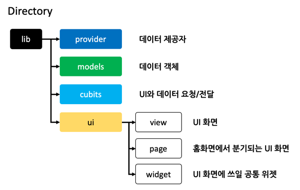

# ac_project_app

- 비사이드 12기 먼데이 로켓팀 프로젝트

## 사용 기술

- Flutter 3.3.2

- DI Architecture: [bloc](https://pub.dev/packages/flutter_bloc)
- main plugins: flutter_bloc, retrofit, very_good_analysis, firebase_auth

## Platform Specification

### Android OS
- sdk: 24 ~ 33
- gradle: 7.4

### iOS
- Minimum Deployments: iOS 15.0

### Source Directory Structure

